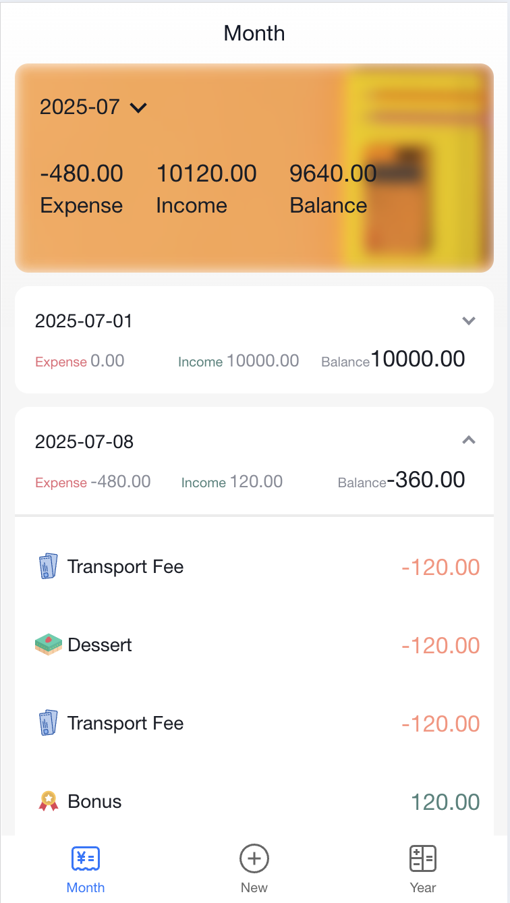
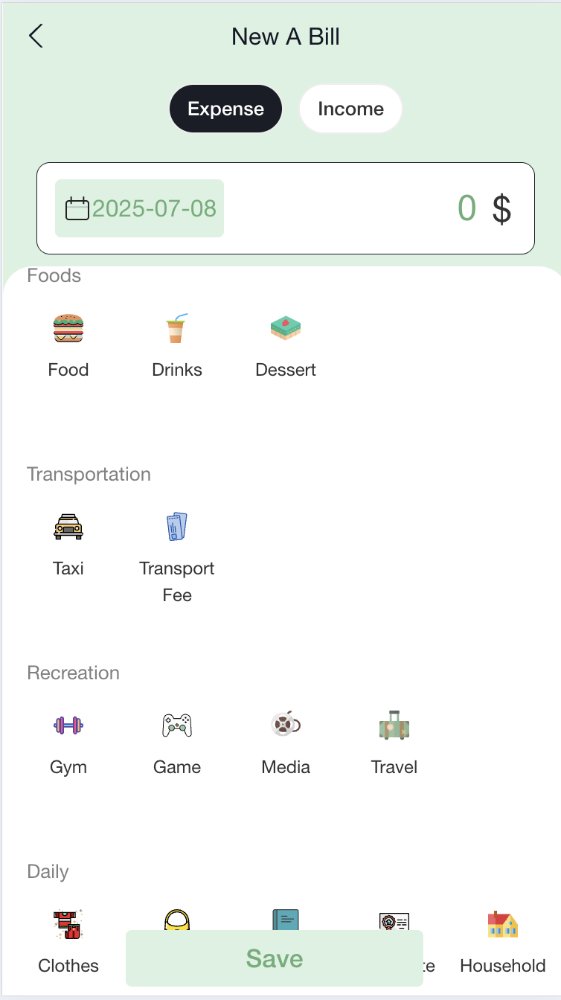
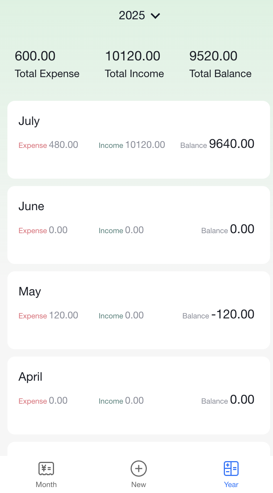

# DailyBill

A lightweight, mobile-first personal finance tracker built with **React 18** and **Vite**.  Record every expense or income on the go and instantly get clear monthly and yearly statistics.

---

## Features

• **Add bills in seconds** – choose _Expense_ or _Income_, pick a category icon, set the date & amount, hit **Save**.

• **Monthly overview** – see total Expense, Income and Balance for the selected month, with a collapsible day-by-day breakdown.

• **Yearly overview** – scroll through each month’s summary and compare spending trends across the whole year.

• **Responsive mobile UI** – powered by [Ant Design Mobile](https://mobile.ant.design/).

• **State management with Redux Toolkit** – predictable, performant global state.

• **Mock REST API** – powered by `json-server`; swap in your real backend at any time.

---

## Screenshots

| Month View | Add Bill | Year View |
|:--:|:--:|:--:|
|  |  |  |

---

## Quick Start
1. **Start the mock API** (serves the data in `data.json`)

   ```bash
   npm run mock
   ```

2. **Run the dev server**

   ```bash
   npm run dev
   ```

3. Open the app in your browser → record your first bill!

## Tech Stack

- **React 18** + **Vite 7** – lightning-fast dev experience
- **Ant Design Mobile 5** – polished mobile components
- **Redux Toolkit** & **React-Redux** – global state management
- **React Router DOM 7** – client-side routing
- **Axios** – HTTP requests
- **Lodash** – utility helpers
- **SCSS** – modular styles


